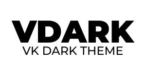
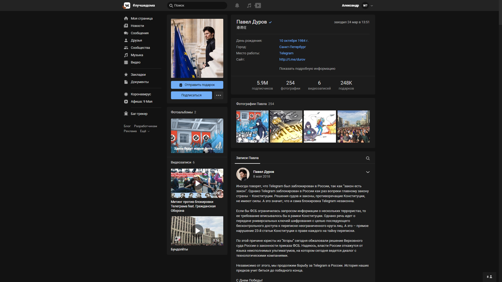
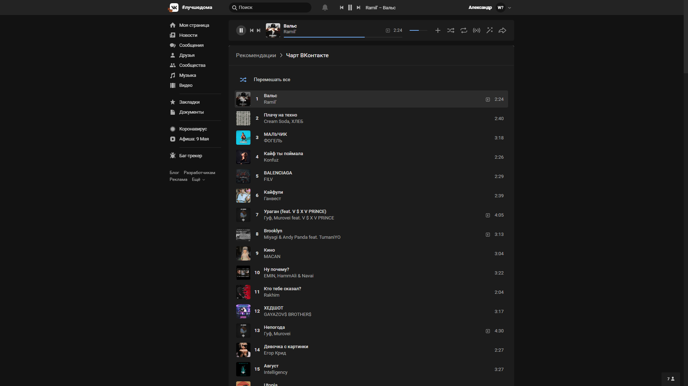

# This repository is dead. Use: [a0eoc/VDARK](https://github.com/a0eoc/VDARK)

<h1 align="center">
     
    
     
</h1>

## Install
**Stylus:**
1. For the theme to work, you need to install the [Stylus](https://chrome.google.com/webstore/detail/stylus/clngdbkpkpeebahjckkjfobafhncgmne) extension.
2. Install [Theme](https://dl.dropboxusercontent.com/s/faysjkwgq5n9m8a/vdark.user.css?dl=0).

## Preview (Version 2.4.0)

## License
Code released under the [CC-BY-NC-4.0](https://spdx.org/licenses/CC-BY-NC-4.0.html#licenseText) license.
